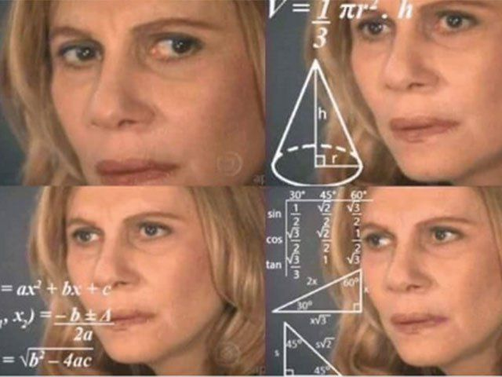

# Introdução



- Paradigmas da Programação: São meios de classificar as linguagens de programação bem como a estruturação dos códigos.

- Programação Funcional:
  1- Factory
  2- Immutability
  3- High Order Functions
  4- Closures
  5- Side Effects
  6- Currying
  7- Recursion
  8- Compose
  9- Trampoline
  10- ............


## 1 - Factory

**São funções que criam objetos e retornam os mesmos.**

O nome factory vem da comparação que é feito comparando as funções com uma fábrica:

```javascript
function createBox(amount) {
	const boxes = Array(amount).fill('Caixa');
	return { boxes };
}

let boxes = createBox(4);
console.log(boxes); // { boxes: [ 'Caixa', 'Caixa', 'Caixa', 'Caixa' ] }
```

Para entender bem como `Factories` funcionam é preciso compreender primeiro o que são `Closures.`

#### 1.1 - Closures

É a capacidade que funções tem de acessar variáveis que são definidas fora do escopo (fora do corpo / em seus parentes) da função.

```javascript
let wallet_price = '1 Real';

function getWalletPrice() {
	console.log(wallet_price);
}

getWalletPrice(); // 1 Real
```

O valor de `wallet_value` não é copiado, o valor é obtido no momento em que a função é chamada, assim é o valor que está atribuído para `wallet_value` naquele momento.

```javascript
let wallet_price = '1 Real';

function getWalletPrice() {
	console.log(wallet_price);
}

getWalletPrice(); // 1 Real

wallet_price = '2 Reais';

function changeWalletPrice() {
	wallet_price = '3 Reaix!!!';
}

getWalletPrice(); // 2 Reais
changeWalletPrice();
getWalletPrice(); // 3 Reaix!!!
```

Mesmo que as funções sejam chamadas em outros arquivos, elas ainda estariam sendo referenciadas a este contexto específico.

```javascript
const global = 'A';
const exist = false;

function init() {
	const inner_const = 'B';
	const exist = true;

	return function innerFunction() {
		const innersub_const = 'C';

		console.log('global', global);
		console.log('inner_const', inner_const);
		console.log('exist', exist);
		console.log('innersub_const', innersub_const);
	};
}

const app = init();
app(); // global A, inner_const B, exist true, innersub_const C
```

Closures podem ser utilizadas de diferentes formas dentro do código como por exemplo para verificar se existem tarefas sendo executadas, evitando múltiplas chamadas a uma API.

```javascript
const fighter_input = document.getElementById('fighter-input');
const fighter_button = document.getElementById('fighter-button');

let is_there_some_task_running = false;

function getFighter(id) {
	if (!is_there_some_task_running) {
		is_there_some_task_running = true;

		console.log(`Lutador Id = ${id}`);

		setTimeout(() => {
			is_there_some_task_running = false;
			console.table({ name: 'Kakaroto', ki: 'Mais de 8000' });
		}, 5000);
	} else {
		console.warn('Já existe uma tarefa sendo executada');
	}
}

fighter_button.addEventListener('click', () => {
	const fighter_id = fighter_input.value;
	getFighter(fighter_id);
}); // {name: 'Kakaroto', ki: 'Mais de 8000'}
```

#### 1.2 - Factory

Agora que revisamos o que são `Closures` podemos continuar com `Factory`, vamos começar analisando o seguinte problema no exemplo de classe:

```javascript
const monster_button = document.getElementById('monster-button');

class Monster {
	constructor() {
		this.sound = 'BIRL!!!';
		this.age = 37;
		this.enemy = 'Árvores do parque Ibirapuera';
	}
	train() {
		console.log(this.sound);
		console.log(this.age);
		console.log(this.enemy);
	}
}

const bodybuilder = new Monster();
bodybuilder.train();
// BIRL!!!, 37, Árvores do parque Ibirapuera

monster_button.addEventListener('click', bodybuilder.train);
// undefined, undefined, undefined
monster_button.addEventListener('click', bodybuilder.train.bind(bodybuilder));
// BIRL!!!, 37, Árvores do parque Ibirapuera
monster_button.addEventListener('click', () => bodybuilder.train());
// BIRL!!!, 37, Árvores do parque Ibirapuera
```

`Factories` nos auxiliam para que estes tipos de erros não aconteçam, o código fica mais limpo e simples de ler:

```javascript
const monster_button = document.getElementById('monster-button');

const monster = () => {
	const sound = 'BIRL!!!';
	const age = 37;
	const enemy = 'Árvores do parque Ibirapuera';

	return {
		train: () => {
			console.log(sound);
			console.log(age);
			console.log(enemy);
		},
	};
};

const bodybuilder = monster();
bodybuilder.train();
// BIRL!!!, 37, Árvores do parque Ibirapuera

monster_button.addEventListener('click', bodybuilder.train);
// BIRL!!!, 37, Árvores do parque Ibirapuera
```

## 2 - Factory na Programação Funcional

Na `Programação Funcional` é preciso seguir o conceito de `Immutability` e `Factory` e `Closures` como comentando anteriormente podem auxiliar com esta tarefa.

**Immutability: Na imutabilidade devemos seguir a regra que diz que a partir do momento que um dado é criado o mesmo não deve ser alterado. Esta regra auxília na prevenção de erros e construção de códigos mais concisos. Para seguir esta regra da Programação Funcional nós devemos criar cópias do dado e realizar alterações nestas cópias, evitando assim efeitos colaterais no dado original.**

#### 2.1 - Copiando Objetos

No JavaScript não podemos simplesmente copiar objetos usando o sinal de atribuição `=`, pois assim estaríamos fazendo uma referência ao espaço de memória alocado para o dado original.

```javascript
const pregnant = { babies_amount: 4, city: 'Taubaté' };

const unmasked_pregnant = pregnant;

unmasked_pregnant.babies_amount = 0;

console.log(pregnant); // babies_amount = 0 e city = Taubaté
console.log(unmasked_pregnant); // babies_amount = 0 e city = Taubaté
```

Porém existem algumas formas de clonar objetos, vamos comentar alguma delas, verifiar as diferenças e entender como tudo que já estudamos até este ponto pode nos ajudar.

```javascript
const pregnant = { babies_amount: 4, city: 'Taubaté' };

// 1 - Object.assign
const unmasked_pregnant_1 = Object.assign({}, pregnant);
unmasked_pregnant_1.babies_amount = 0;
console.log(unmasked_pregnant_1);
// babies_amount = 0 e city = Taubaté

// 2 - Spread Operator
const unmasked_pregnant_2 = { ...pregnant };
unmasked_pregnant_2.babies_amount = 0;
console.log(unmasked_pregnant_2);
// babies_amount = 0 e city = Taubaté

console.log(pregnant);
// babies_amount = 4 e city = Taubaté
```

Como foi possível observar nos exemplos, a alteração realizada nos objetos clonados não teve efeito no objeto original, porém ainda existem situações que mesmo utilizando uma destas formas vamos ter erros no código, como por exemplo em casos onde o dado de entrada (dado que vai ser clonado) possuir mais de um nível. Nestes casos somente o primeiro nível é clonado os demais ainda são referenciados.

**Deep Nested Objects: São os objetos que estão dentro de outros objetos.**

```javascript
const villain = {
	slogan_1: {
		text: 'Ahhhh!!! to com depressão!!!',
	},
	slogan_2: {
		text: 'Mentira!!!',
	},
};

// 1 - Object.assign
const villain_1 = Object.assign({}, villain);
villain_1.slogan_1.text = 'Mentira to aqui com minha Buduvieser!!!';
console.log(villain_1);
// Mentira to aqui com minha Buduvieser!!!, Mentira!!!

// 2 - Spread Operator
const villain_2 = { ...villain };
villain_2.slogan_2.text = 'Mentira to aqui com minha Buduvieser!!!';
console.log(villain_2);
// Mentira to aqui com minha Buduvieser!!!, Mentira to aqui com minha Buduvieser!!!

console.log(villain);
// Mentira to aqui com minha Buduvieser!!!, Mentira to aqui com minha Buduvieser!!!
```

Para solucionar este problema de objetos com mais de um nível podemos clonar objetos com uma terceira forma:

```javascript
const villain = {
	slogan_1: {
		text: 'Ahhhh!!! to com depressão!!!',
	},
	slogan_2: {
		text: 'Mentira!!!',
	},
};

// 3 - JSON
const villain_3 = JSON.parse(JSON.stringify(villain));
villain_3.slogan_2.text = 'Mentira to aqui com minha Buduvieser!!!';
console.log(villain_3);
//Ahhhh!!! to com depressão!!!, Mentira to aqui com minha Buduvieser!!!

console.log(villain);
// Ahhhh!!! to com depressão!!!, Mentira!!!
```

Como foi possível observar no exemplo, todos os níves foram clonados, porém ainda existe uma terceira situação específica que nenhuma das formas que aprendemos até o momento vai nos ajudar, que é quando o valor de uma propriedade é uma função, portanto é considerada um método do objeto.

```javascript
const woody_woodpecker = {
	slogan_1: {
		text: 'Essa gente inventa cada coisa',
	},
	slogan_2: {
		text: () => 'Essa vai ser a minha melhor vigarice',
	},
};

try {
	console.log(woody_woodpecker.slogan_2.text());
	// Essa vai ser a minha melhor vigarice

	// 3 - JSON
	const woody_woodpecker_1 = JSON.parse(JSON.stringify(woody_woodpecker));
	console.log(woody_woodpecker_1);
	// Essa gente inventa cada coisa, {}
	woody_woodpecker_1.slogan_2.text();
	// Código quebra => catch
} catch (error) {
	console.error(error.message);
	// woody_woodpecker_1.slogan_2.text is not a function
}
```

#### 2.2 - Resolvendo os problemas de cópia com Factory

Bem aprendemos algumas formas que podem nos ajudar dependendo da estrutura do dado que prentendemos copiar, mas pensando de forma Funcional vamos aprender uma forma definitiva que abrange todas as situações comentandas anteriormente, vamos usar funções para criar os objetos, assim mesmo se o dado possuir mais de um nível e funções, vamos conseguir cumprir a regra de imutabilidade, bem como adicionar novas funcionalidades bem interessantes.

```javascript
const woody_woodpecker = () => {
	return {
		slogan_1: {
			text: 'Essa gente inventa cada coisa',
		},
		slogan_2: {
			text: () => 'Essa vai ser a minha melhor vigarice',
		},
	};
};

let woody_woodpecker_1 = woody_woodpecker();
console.log(woody_woodpecker_1.slogan_1.text);
// Essa gente inventa cada coisa
console.log(woody_woodpecker_1.slogan_2.text());
// Essa vai ser a minha melhor vigarice

woody_woodpecker_1 = null;
delete woody_woodpecker_1;

let woody_woodpecker_2 = woody_woodpecker();

let woody_woodpecker_3 = woody_woodpecker();
```

Criando e manipulando os objetos desta forma não vamos modificar o objeto original, mesmo porque o mesmo não existe em nenhum espaço de referência na memória, evitamos assim espaços desnecessários, uma vez que alocamos memória somente nos momentos em que realmente precisamos dentro do código e seguimos a regra de imutabilidade.

**Garbage Collection: Ao utilizar a forma que estudamos neste tópico é importante lembrar de limpar os objetos que copiamos, quando não for mais necessário a utilização dos mesmos, assim sempre que um dado copiado não fazer mais sentido no seu código é preciso atribuir null para o mesmo e em seguida deletar.**

Trabalhando com dados desta forma funcional, somos benefeciados com novas funcionalidades, onde é possível criar estados e métodos privados e criar contextos (injeção de dependências), como estudamos até este ponto do tutorial conhecemos esta estrutura como `Factory`.

```javascript
const woody_woodpecker = (slogan = 'slogan_1') => {
	const _private_state = {
		slogan_1: 'E lá vamos nós!',
		slogan_2: 'Ora Frank, falando francamente, sejamos amigos em?',
	};

	const _private_method = (key) => {
		return _private_state[key] || 'Yo no lo conozco, señor';
	};

	return {
		slogan_1: {
			text: 'Essa gente inventa cada coisa',
		},
		slogan_2: {
			text: () => 'Essa vai ser a minha melhor vigarice',
		},
		slogan_3: {
			text: () => {
				const option = _private_method(slogan);
				return `Frase Selecionada: ${option}`;
			},
		},
	};
};

let woody_woodpecker_1 = woody_woodpecker();
console.log(woody_woodpecker_1.slogan_1.text);
console.log(woody_woodpecker_1.slogan_2.text());
console.log(woody_woodpecker_1.slogan_3.text());
// Frase Selecionada: E lá vamos nós!

woody_woodpecker_1 = null;
delete woody_woodpecker_1;

let woody_woodpecker_2 = woody_woodpecker('slogan_1');
console.log(woody_woodpecker_2.slogan_3.text());
// Frase Selecionada: E lá vamos nós!

let woody_woodpecker_3 = woody_woodpecker('slogan_2');
console.log(woody_woodpecker_3.slogan_3.text());
// Frase Selecionada: Ora Frank, falando francamente, sejamos amigos em?

let woody_woodpecker_4 = woody_woodpecker('slogan_3');
console.log(woody_woodpecker_4.slogan_3.text());
// Frase Selecionada: Yo no lo conozco, señor
```


Depois de toda essa conversa e brincadeiras é preciso deixar claro que isso não são problemas do JavaScript, pois quando o mesmo foi criado ele foi pensado para ser Multiparadigma e uma vez que em 1996 não existia espaço de memória suficiente para cópias, o JavaScript foi pensado para salvar referências.
